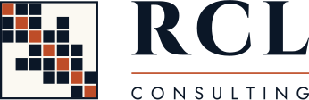

<picture>
  <source media="(prefers-color-scheme: dark)" srcset="rcl-logo-reversed.svg">
  
</picture>

**Structural engineering software** 
Software products • Custom development

RCL Consulting builds analysis and design software for structural engineers. The work published here is open source:

- **[OpenDLO](https://github.com/RCL-Consulting/OpenDLO)** — discontinuity layout optimisation of plates: the ultimate load a plate can carry, from a C++ library.
- **[QuadMind](https://github.com/RCL-Consulting/QuadMind)** — quad meshing for finite elements: Q-Morph ported to C++20, with machine-learning experiments.
- **[QMVision](https://github.com/RCL-Consulting/QMVision)** — an OpenGL viewer for inspecting and debugging QuadMind meshes.
- **[Wombat](https://github.com/RCL-Consulting/Wombat)** — work-based assessment of medical specialists through entrustable professional activities.

[rcl.co.za](https://rcl.co.za) · [info@rcl.co.za](mailto:info@rcl.co.za)
